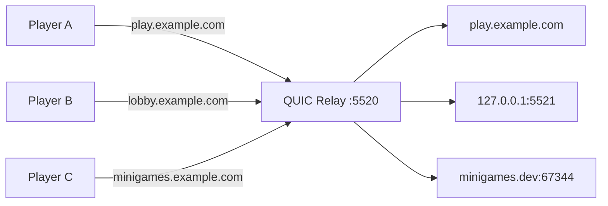

<p align="center">
  
</p>

# QUIC Relay

[](https://github.com/HyBuildNet/quic-relay/actions/workflows/ci.yml)

A reverse proxy for Hytale servers/Raw QUIC SNI parsing. Route players to different Hytale-Servers based on the domain they connect to.
According to Hytale's official server guide the "Minecraft"-like SRV implementation is not yet available ([source](https://support.hytale.com/hc/en-us/articles/45326769420827-Hytale-Server-Manual#:~:text=ecosystem-,SRV,exists)).
And therefore a QUIC-Proxy might be the only convenient way for achieving standard port + multiple servers.



## Quickstart

```bash
curl -sSL https://raw.githubusercontent.com/HyBuildNet/quic-relay/master/dist/install.sh | sudo bash
sudo systemctl enable --now quic-relay
```

Configure via `/etc/quic-relay/config.json`. Reload with `systemctl reload quic-relay`.

### Docker

```bash
docker run -p 5520:5520/udp ghcr.io/hybuildnet/quic-relay:latest
```

```bash
podman run -p 5520:5520/udp ghcr.io/hybuildnet/quic-relay:latest
```

Or mount your config:
```bash
docker run -p 5520:5520/udp -v /path/to/config.json:/data/config.json ghcr.io/hybuildnet/quic-relay:latest
```

## Handlers

Handlers form a chain. Each handler processes the connection and either passes it to the next handler (`Continue`), handles it (`Handled`), or drops it (`Drop`).
Custom handlers can be implemented quite easily, but the project needs to be recompiled.

### sni-router

Routes connections to different backends based on SNI. Each route can be a single backend or multiple backends (array) for round-robin load balancing. Connections with unknown SNI are dropped.

```json
{
  "listen": ":5520",
  "handlers": [
    {
      "type": "sni-router",
      "config": {
        "routes": {
          "play.example.com": "10.0.0.1:5520",
          "lobby.example.com": ["10.0.0.2:5520", "[2001:db8::1]:5520"],
          "minigames.example.com": "myserver.internal.dev:5520"
        }
      }
    },
    {"type": "forwarder"}
  ]
}
```
[?] Why do we need the `{"type": "forwarder"}` here? The forwarding logic is implemented as a handler itself, this way we can easily replace the forwarding logic with some kind of
terminating-logic, which can read the Hytale-Protocol itself and is capable to dig deeper into the game logic rather than just proxy traffic through.

### simple-router

Routes all connections to one or more backends. Use `backend` for a single destination or `backends` for round-robin load balancing.

```json
{
  "listen": ":5520",
  "handlers": [
    {"type": "ratelimit-global", "config": {"max_parallel_connections": 10000}},
    {
      "type": "simple-router",
      "config": {
        "backends": ["10.0.0.1:5520", "10.0.0.2:5520", "[2001:db8::1]:5520"]
      }
    },
    {"type": "forwarder"}
  ]
}
```

### ratelimit-global

Limits the total number of concurrent connections. New connections are dropped when the limit is reached.

### forwarder

Forwards packets to the backend. Must be the last handler in the chain.

### logsni

Logs the SNI of each connection. Useful for debugging.

```json
{
  "listen": ":5520",
  "handlers": [
    {"type": "logsni"},
    {"type": "sni-router", "config": {"routes": {"play.example.com": "10.0.0.1:5520"}}},
    {"type": "forwarder"}
  ]
}
```

## Advanced

### Global config options

```json
{
  "listen": ":5520",
  "session_timeout": 600,
  "handlers": [...]
}
```

- `session_timeout` - Idle session timeout in seconds (default: `600` = 10 minutes). Sessions without traffic are cleaned up after this duration. Can be changed via hot-reload (SIGHUP).

### Environment variables

Fallback when not set in config:
- `QUIC_RELAY_LISTEN` - Listen address (default: `:5520`)
- `QUIC_RELAY_BACKEND` - Backend address for `simple-router`

## Build

```bash
make build
```

Produces `bin/proxy`.

## License

MIT License. See [LICENSE](LICENSE) for details.

[!] This project is neither related to nor affiliated with HYPIXEL STUDIOS CANADA INC. or any other Trademark owner of Hytale.
